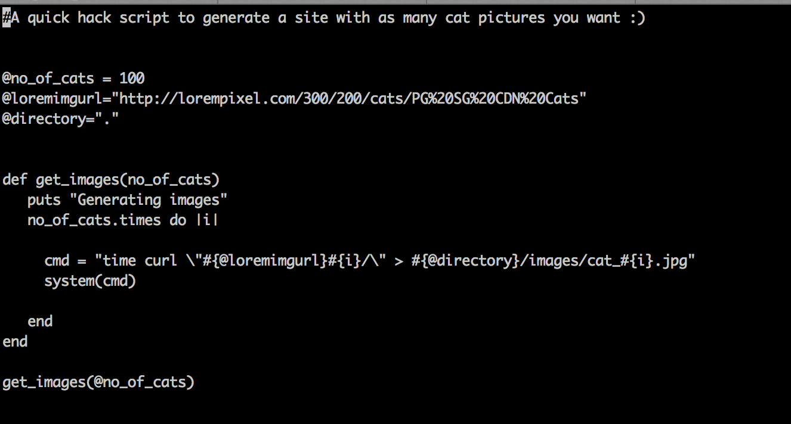
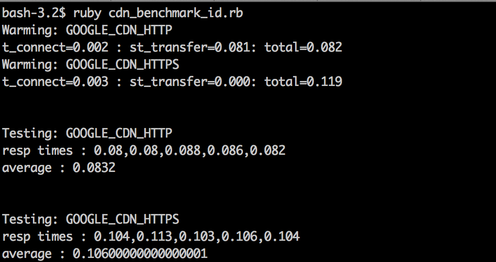

Catsite Generator
================

  This is a handy script, helpful when you need to benchmark CDNs. It allows you to generate a site with as many cat pictures you want!

How does it work? Look at simplified version below:

What do you get?

And there is cdn_benchmark.rb , which helps you perform the test

 

 Copyright (c) 2015 [Abhishek Parolkar] abhishek[at]parolkar.com , released under the MIT license 

